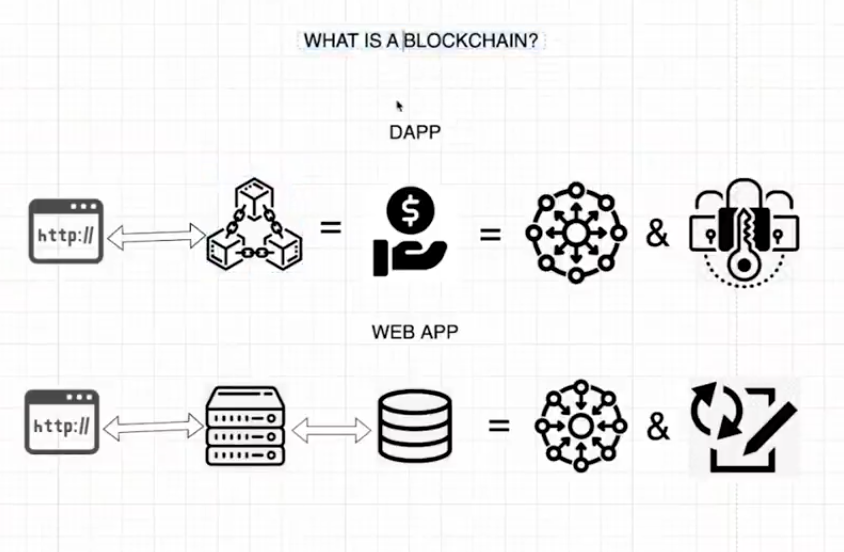
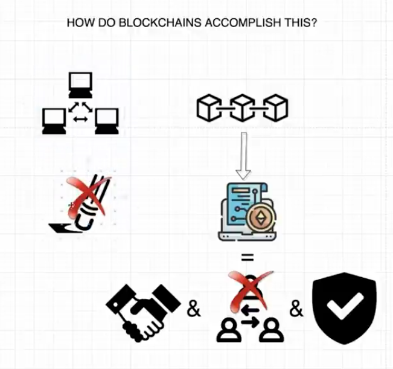
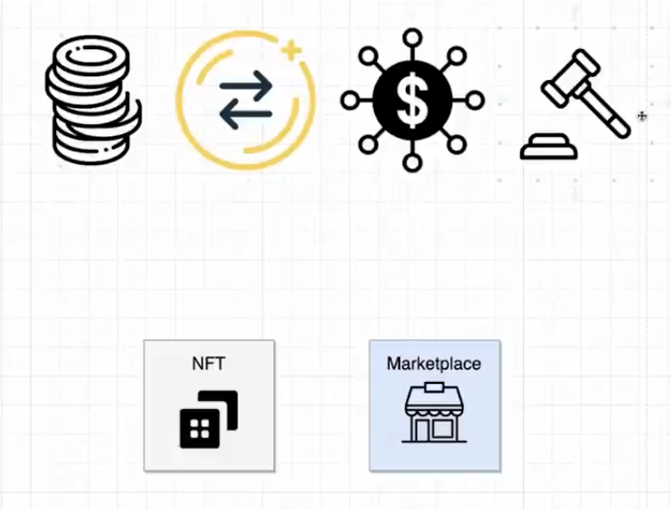
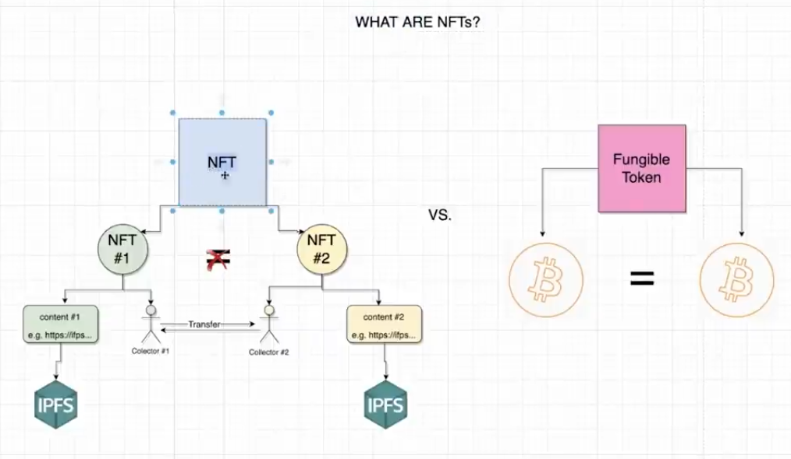

<h1 align="center">
  <a href="https://github.com/ThunderBolt-OS/NFT-Marketplace-for-Artisan">
    <!-- Please provide path to your logo here -->
    
  </a>
</h1>

<div align="center">
  NFT-Martkeplace-for-Artisan
  <br />
  <a href="#about"><strong>Explore the screenshots »</strong></a>
  <br />
  <br />
  <a href="https://github.com/ThunderBolt-OS/NFT-Marketplace-for-Artisan/issues/new?assignees=&labels=bug&template=01_BUG_REPORT.md&title=bug%3A+">Report a Bug</a>
  ·
  <a href="https://github.com/ThunderBolt-OS/NFT-Marketplace-for-Artisan/issues/new?assignees=&labels=enhancement&template=02_FEATURE_REQUEST.md&title=feat%3A+">Request a Feature</a>
  .<a href="https://github.com/ThunderBolt-OS/NFT-Marketplace-for-Artisan/discussions">Ask a Question</a>
</div>

<div align="center">
<br />

[](LICENSE)

[](https://github.com/ThunderBolt-OS/NFT-Marketplace-for-Artisan/issues?q=is%3Aissue+is%3Aopen+label%3A%22help+wanted%22)
[](https://github.com/ThunderBolt-OS)

</div>

<details open="open">
<summary>Table of Contents</summary>

- [About](#about)
- [Project Review](#project-review)
  - [What is Blockchain?](#what-is-blockchain)
  - [How Do Blockchains Accomplish This ?](#how-do-blockchains-accomplish-this-)
  - [Creation of Smart Contract](#creation-of-smart-contract)
  - [What Are NFTs?](#what-are-nfts)
  - [NFT Contract](#nft-contract)
  - [MarketPlace Contract](#marketplace-contract)
  - [Built With](#built-with)
- [Getting Started](#getting-started)
  - [Prerequisites](#prerequisites)
  - [Installation](#installation)
    - [Clone the Repository by running.](#clone-the-repository-by-running)
    - [Install the Dependencies](#install-the-dependencies)
    - [Run the Project](#run-the-project)
    - [Environment Variable](#environment-variable)
    - [To Check The Frontend part of the project](#to-check-the-frontend-part-of-the-project)
    - [To Check The Backend part of the project](#to-check-the-backend-part-of-the-project)
    - [File Structure](#file-structure)
- [Roadmap](#roadmap)
- [Contributing](#contributing)
- [Authors & contributors](#authors--contributors)
- [Security](#security)
- [License](#license)

</details>

---

## About

<table><tr><td>

This Project is Made for Artisans to Counter the Counterfieting their Arts. 
Artisans can create NFTs of their products without worrying about the gas fees, thanks to Polygon Network as 1 MATIC is equal to  $0.87865.
So if customer is buying the NFT from his/her store, Buyer will buy the NFT form this Marketplace to ensure that the Art is Original. 


</details>

</td></tr></table>

## Project Review

### What is Blockchain?


What is a blockchain and why do we need it? In essence, a blockchain is a distributed ledger that powers decentralized applications or DApps for short a DApp is different from most traditional web applications in that the client side website the part of the app that users interact with doesn't talk to a centralized server that connects to a database. Instead, the adapter lies on the blockchain to store data, but not just any type of data. The data that represents value so you might be asking why should we use a blockchain as opposed to a regular web app to store value well the problem is that if, for instance, someone wanted to make a digital currency using a centralized database with the server, everyone who held the currency would have to trust that the person in control of managing the database would not arbitrarily change people's balances without their permission and the developers of the server don't change the app source code For this reason, blockchains provide a solution to this. Because they are decentralized and immutable, you can create a digital currency or a digital representation of any asset for that matter, using the blockchain. They circumvent the need for trust. 

### How Do Blockchains Accomplish This ?


A blockchain is made up of a network of computers called nodes, which each contains an arbitrary copy of all the data collected within the network. You can gain access to the entire network by connecting to any one of these nodes. The data is stored in bundles of records called blocks that are chained together by the preceding block all the way down to the genesis block. When a new transaction occurs on the blockchain, all the nodes execute the transaction in order to verify it and achieve consensus. Once that happens, there is no way to revert or modify the transaction. It stays on the blockchain forever on the Ethereum network. You can also deploy smart contracts, which are complete programs that run on the blockchain. Smart contracts allow you to build any arbitrary application that handles business logic or agreements between different parties in a trustless manner.

### Creation of Smart Contract


Using smart contracts, you can create Ethereum-based tokens, exchanges, crowdfunds, or auctions to name just a few, but here we're going to build just two smart contracts that will power our NFT marketplace one that represents a collection of NFTs and another that allows users to buy and sell them.


### What Are NFTs?

NFT is a non-fundable token which means that it can't be interchanged for another NFT within the same collection, so why is each NFT worth differently? Well, unlike regular fungible tokens like Ethereum, bitcoin, or even US dollars, it matters which NFT you own. For instance, the first bitcoin ever mined is worth the same as the last bitcoin mined but for NFT each one has unique qualities about it that make them appear more or less valuable compared to any other. NFT smart contracts associate each NFT with an ID and a link to where the content of the NFT can be found on the web. This content can be an image, a piece of music, or even a video, but most of the time it's just an image. storing large files like this directly on the blockchain is very expensive and sometimes impossible so as a workaround these files are normally stored on a decentralized file storing system like IPFS and the hash that points to where these files are located is stored in the blockchain and the NFT smart contract also keeps track of the owners of each NFT. There are special functions on the contract that allow us to transfer NFT to new addresses.

### NFT Contract 


We're going to create a marketplace contract that interacts with these functions on the NFT contract to allow users to buy and sell NFT. When a user wants to list their NFT for sale they will call a function that will transfer their NFT to the marketplace and the marketplace will keep track of the seller of the NFT and the price they want to sell it.

### MarketPlace Contract


Customers can buy any listed NFT (By Artisans) by calling a function that transfers the amount of Ether (MATIC)  the NFT was priced at from the Artisan. The seller then transfers the NFT from the marketplace to the buyer also our NFT contract will have a mint function that will allow sellers to create new NFTs and then list them on the marketplace 


### Built With

> - [React](https://reactjs.org/) For Frontend Development.
> - [HardHat](https://hardhat.org/) For Backend Development Environment to  test, compile, deploy and debug dApps based on the Ethereum Blockchain.
> - [Ethers.JS](https://docs.ethers.io/v5/) For Interaction with the Ethereum Blockchain.
> - [IPFS](https://ipfs.io/) For File Storage.
> - [Solidity](https://docs.soliditylang.org/en/v0.8.15/) For Smart Contract Development.
> - [Chai.JS](https://www.chaijs.com/) For Testing Smart Contracts.
> - [Alchemy](https://www.alchemy.com/) For Deploying Smart Contracts.

## Getting Started

### Prerequisites
> Node JS and npm are required to run this project.

### Installation

#### Clone the Repository by running.
```bash
git clone https://github.com/ThunderBolt-OS/NFT-Market-For-Artisans.git

cd NFT-Market-For-Artisans
```

#### Install the Dependencies
```bash
npm install 
```

#### Run the Project
```bash
npm start                 # in 1st Terminal (spins up the react)
npx hardhat compile       # in 2nd Terminal (to compile the smart contract and create an ABI)
npx hardhat node          # in 3rd Terminal (to run the local blockchain)
   
```

#### Environment Variable
> - Go to [Alchemy](https://www.alchemy.com/) and Login to create an account.
> - Select the Ecosystem you want. (Whether Ethereum or Solana or Crypto.org or Flow) And then click on get started
> - Now add your Team Name, your DApp Name and select the network you want, here we chose Polygon Mumbai Testnet.
> - Now click on Free Plan, then dashboard interface should be visible.
> - On Top Right corner of the dashboard, click on the "+ CREATE APP" button. Add your DApps name and description. Select the chain and network. Here we chose Polygon as Chain and Network as Mumbai (which is by default testnet).
> Then click on "VIEW KEY" button. You will see you RPC url. Copy this url and paste it in the environment variable.
> - Install [MetaMask](https://metamask.io/). this will install chrome extension for metamask.
> - Go back to Alchemy click on the Dapp you have created and click on the "ADD TO WALLET" button to add Mumbai MATIC to your wallet.
> - Now copy your metamask Private key and paste it in the environment variable.

```bash}

REACT_APP_ALCHEMY_API_URL = <Your Alchemy RPC URL>
REACT_APP_METAMASK_PRIVATE_KEY = <Your Metamask Private Key>
```


#### To Check The Frontend part of the project
```bash
cd src/frontend
```


#### To Check The Backend part of the project
```bash
cd src/backend
```
#### File Structure
```
├── .github
├── docs
├── node_modules
├── public
├── src
│   ├── backend
|   |   ├── artifacts (#this will only get created when you run 2nd command in terminal)
|   |   ├── cache
|   |   ├── contracts
|   |   |     |── Marketplace.sol
|   |   |     └── NFT.sol
|   |   ├── scripts
|   |   |     └── deploy.js
|   |   ├── test
|   |   |     └─ NFTMarketplace.test.js
│   ├── frontend
│   │   ├── components
│   │   │   ├── Cards.jsx
│   │   │   ├── Drawer.jsx
│   │   │   ├── index.js
│   │   │   └── Navbar.jsx
│   │   ├── contractsData
│   │   │   ├── Marketplace-address.json
│   │   │   |── Marketplace.json
|   │   │   ├── NFT-address.json
│   │   │   └── NFT.json
│   │   ├── pages
|   │   │   ├── Create.jsx
|   │   │   ├── Home.jsx
|   │   │   ├── index.js
|   │   │   ├── MyListedItems.jsx
|   │   │   └── MyPurchases.jsx
│   │   ├── styles
|   │   │   └── App.css
│   │   └── App.js
│   |── index.js
|   └── serviceWorker.js
├── .babelrc
├── .env
├── .gitignore
├── hardhat.config.js
├── LICENSE
├── package-lock.json
├── package.json
└── README.md
```

## Roadmap

See the [open issues](https://github.com/ThunderBolt-OS/NFT-Marketplace-for-Artisan/issues) for a list of proposed features (and known issues).

- [Top Feature Requests](https://github.com/ThunderBolt-OS/NFT-Market-For-Artisans/blob/main/.github/ISSUE_TEMPLATE/02_FEATURE_REQUEST.md) (Add your votes using the 👍 reaction)
- [Top Bugs](https://github.com/ThunderBolt-OS/NFT-Market-For-Artisans/blob/main/.github/ISSUE_TEMPLATE/01_BUG_REPORT.md) (Add your votes using the 👍 reaction)
- [Newest Bugs](https://github.com/ThunderBolt-OS/NFT-Market-For-Artisans/blob/main/.github/ISSUE_TEMPLATE/01_BUG_REPORT.md)


Reach out to the maintainer at one of the following places:

- [GitHub Discussions](https://github.com/ThunderBolt-OS/NFT-Marketplace-for-Artisan/discussions)
- Contact options listed on [this GitHub profile](https://github.com/ThunderBolt-OS)

## Contributing

First off, thanks for taking the time to contribute! Contributions are what make the open-source community such an amazing place to learn, inspire, and create. Any contributions you make will benefit everybody else and are **greatly appreciated**.

Please read [our contribution guidelines](https://github.com/ThunderBolt-OS/NFT-Market-For-Artisans/blob/main/docs/CONTRIBUTING.md), and thank you for being involved!

## Authors & contributors

The original setup of this repository is by [Soham Bhoir](https://github.com/ThunderBolt-OS).

For a full list of all authors and contributors, see [the contributors page](https://github.com/ThunderBolt-OS/NFT-Marketplace-for-Artisan/contributors).

## Security

NFT-Martkeplace-for-Artisan follows good practices of security, but 100% security cannot be assured.
NFT-Martkeplace-for-Artisan is provided **"as is"** without any **warranty**. Use at your own risk.

_For more information and to report security issues, please refer to our [security documentation](https://github.com/ThunderBolt-OS/NFT-Market-For-Artisans/blob/main/docs/SECURITY.md)._

## License

This project is licensed under the **MIT license**.

See [LICENSE](LICENSE) for more information.


